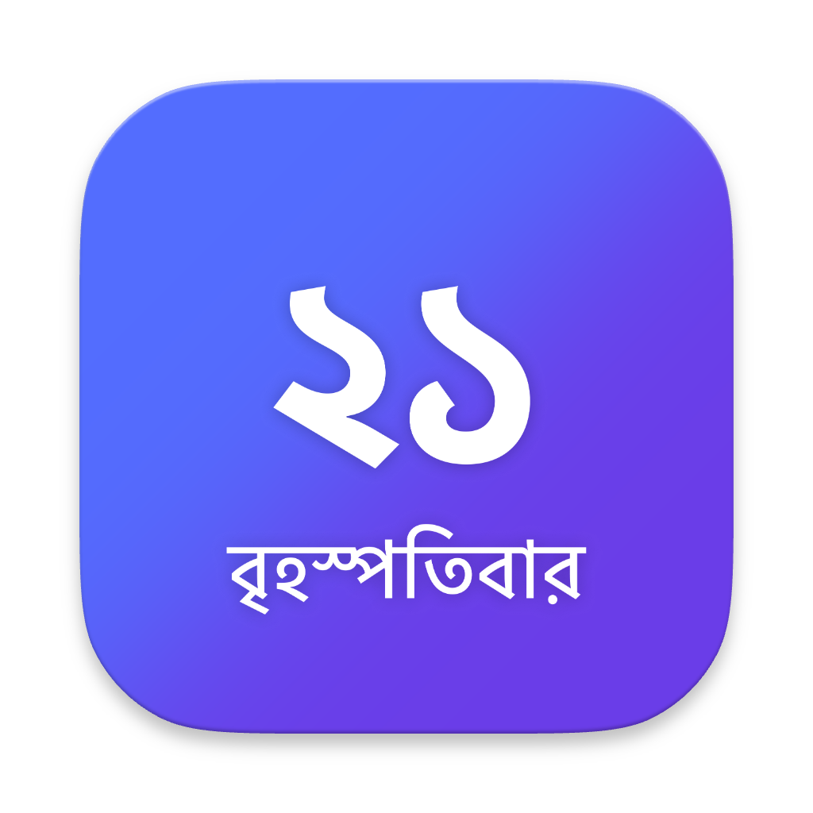
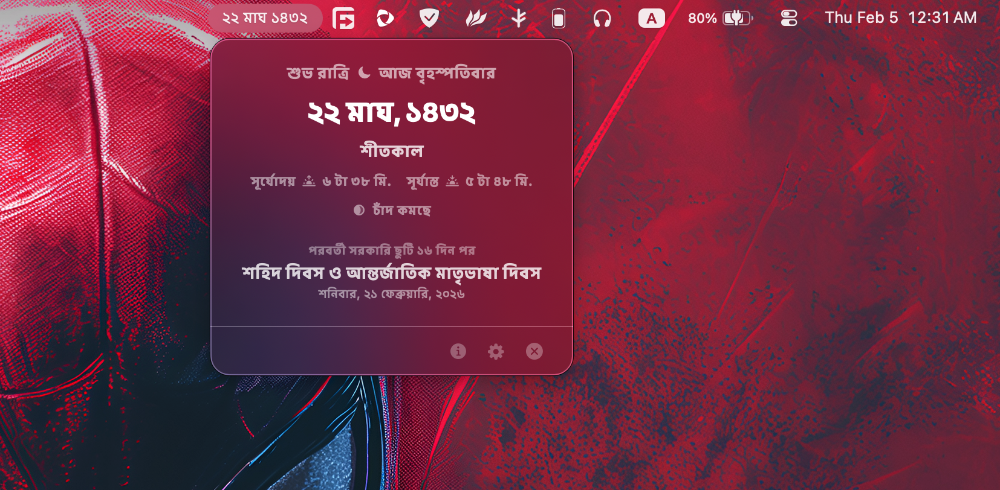

# 🇧🇩 BanglaBar

<p align="center">
  
</p>

**আপনার ম্যাকের মেনু বারে বাংলার দিনপঞ্জি।**

A native, lightweight macOS app that brings the **Revised Bangla Calendar** right to your menu bar. No more guessing what Bengali date is today. Built with love in Dhaka for the global Bengali community.

<p align="center">
  <a href="https://github.com/ffrafat/BanglaBar/releases">
    
  </a>
</p>



## ✨ Features (বৈশিষ্ট্য)

*   **📅 Accurate Date**: Shows the current date using the officially Revised Bangla Calendar (Bangladesh Version; NOT INDIAN ONE) logic.
*   **🌤️ Solar & Lunar**: Live Sunrise/Sunset times (Dhaka standard) and current Moon Phase (Chand-er obostha).
*   **🍂 Seasons (ঋতু)**: Automatically updates the current season.
*   **🎉 Holidays**: Alerts you about today's holidays and counts down to the next government holiday.
*   **⚙️ Customizable**: Choose between Short, Medium, or Long date formats.
*   **🚀 Native**: Blazing fast, written in pure Swift, and looks right at home on macOS.

## 📥 Installation (কিভাবে ইন্সটল করবেন - Important!)

Since I am an independent developer and not paying Apple $99/year yet, this app is **not notarized**. macOS Gatekeeper will likely block it by default, saying the app is "damaged" or from an "unidentified developer".

**Don't worry, it's safe. Here is the magic command to fix it:**

1.  **Download** the latest `.dmg` from the [Releases](../../releases) page.
2.  **Open** the downloaded disk image and drag `BanglaBar.app` to your **Applications** folder.
3.  **The Fix**: Open your **Terminal** app and run this single command to tell macOS you trust this app:

    ```bash
    xattr -cr /Applications/BanglaBar.app
    ```

4.  **Launch** the app! 🚀

> *Note: This command simply removes the "quarantine" flag that macOS places on internet downloads.*

## 🛠️ Build it yourself (ডেভেলপারদের জন্য)

If you prefer to verify the code and build it yourself:

1.  Clone the repo:
    ```bash
    git clone https://github.com/ffrafat/banglabar.git
    cd banglabar
    ```
2.  Build the release version using the included script:
    ```bash
    ./release_build.sh
    ```
3.  Find the app in the `build/Release` folder.

## 🤝 Open Source

This project is open to everyone. Feel free to open issues, suggest features, or submit PRs. Let's make this the best Bengali utility for macOS.

---
*Developed with ❤️ in Dhaka by [Faisal F Rafat](https://rafat.cc)*
